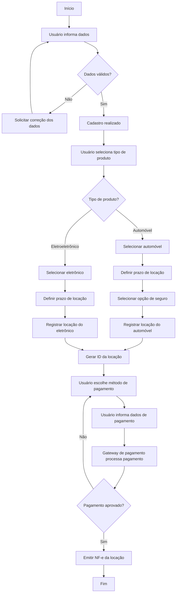

## Membros do Grupo: 
- Ana Carolina Lazzuri - 22.123.001-4
- Paulo Hudson - 22.222.013-9
- Nathan Gabriel da Fonseca Leite - 22.123.028-7
- Raphael Garavati Herbert - 22.123.014-7
---
# LocaFácil

## Objetivo do Projeto
O objetivo deste laboratório é a criação de uma plataforma que facilite o acesso à locação de automóveis e eletrônicos, permitindo que pessoas físicas e empresas utilizem bens de alto custo sem a necessidade de aquisição.

---

## Domínio do Sistema

- **Domínio:** Locação de automóveis e eletrônicos  
- **Problema resolvido:** Facilita o acesso a bens de alto custo por meio de locação  
- **Usuários principais:** Pessoas físicas e empresas  

---

## Visão Geral do Sistema

- **Nome do sistema:** LocaFácil  
- **Usuários principais:** Pessoas físicas e empresas  
- **Funcionalidades principais:**
  - Cadastro de usuários
  - Locação de automóveis e eletrônicos
  - Seleção de seguro para automóveis
  - Pagamento da locação

---

## Processos de Negócio

### Cadastro
- **Entrada:** Dados do usuário  
- **Saída:** Cadastro realizado  
- **Atores envolvidos:** Usuário  

### Locação
- **Entrada:**  
  - Seleção do produto (automóveis ou eletrônicos)  
  - Prazo de locação  
  - Opção de contratação de seguro (para automóveis)  
- **Saída:** Identificador da locação  
- **Atores envolvidos:** Usuário  

### Pagamento
- **Entrada:** Método de pagamento e dados de pagamento  
- **Saída:** Nota fiscal eletrônica (NF-e) da locação  
- **Atores envolvidos:** Usuário e gateway de pagamento  

---

## Diagrama Simplificado de Processo

---

## Linguagens e Framewors utilizados

- React
- NodeJS
- PostgreeSQL

## Arquitetura Geral

A arquitetura do **LocaFacil** foi projetada com foco em **modularidade, manutenibilidade e reuso de software**, adotando uma abordagem **serverless**. O sistema é composto por um frontend desenvolvido em **React**, que se comunica com uma **API em Node.js** hospedada na **Vercel**, e utiliza **PostgreSQL** como banco de dados relacional gerenciado pela **Neon**.

Essa arquitetura elimina a necessidade de servidores dedicados, reduzindo a complexidade de gerenciamento de infraestrutura e permitindo escalabilidade automática conforme a demanda. O uso de serviços gerenciados reforça a separação de responsabilidades e contribui para um baixo acoplamento entre as camadas do sistema.

---

## Justificativa das Tecnologias Utilizadas

### Frontend – React 

O React foi escolhido como framework de frontend por sua abordagem baseada em **componentes reutilizáveis**, o que favorece diretamente o **reuso de software em nível de componentes**. Essa característica permite que partes da interface sejam reaproveitadas em diferentes telas e contextos da aplicação.

Além disso, o React possui:
- Alta maturidade e ampla adoção no mercado;
- Grande ecossistema de bibliotecas reutilizáveis;
- Forte apoio da comunidade e documentação consolidada.

Do ponto de vista arquitetural, o React contribui para a modularidade da aplicação e facilita a evolução incremental do sistema.

---

### Backend – API Serverless com Node.js no Vercel

A API foi desenvolvida em **Node.js**, utilizando o modelo **serverless** disponibilizado pela plataforma **Vercel**. Essa escolha representa um **reuso de serviços e infraestrutura**, evitando o desenvolvimento e a manutenção de servidores próprios.

O Node.js possibilita o reuso de bibliotecas maduras do ecossistema JavaScript e facilita a integração com o frontend. Já o Vercel oferece:
- Deploy automatizado;
- Escalabilidade sob demanda;
- Redução do esforço operacional.

Arquiteturalmente, essa decisão promove baixo acoplamento entre frontend e backend, além de permitir que as APIs sejam reutilizadas futuramente por outras aplicações ou clientes.

---

### Banco de Dados – PostgreSQL na Neon

O PostgreSQL foi escolhido por ser um sistema de banco de dados relacional robusto, amplamente testado e adotado no mercado. Sua utilização por meio da plataforma **Neon** caracteriza um **reuso de sistema completo**, com forte impacto arquitetural.

A Neon fornece o PostgreSQL como um serviço totalmente gerenciado, garantindo:
- Alta disponibilidade;
- Escalabilidade automática;
- Integridade e consistência dos dados.

Essa abordagem reduz o esforço de configuração e manutenção, permitindo que o foco do desenvolvimento permaneça na lógica de negócio.

---

## Reuso de Artefatos

O projeto aplica reuso de software em diferentes níveis:

- **Reuso de Frameworks**: React e Node.js fornecem estruturas prontas que evitam a criação de soluções do zero.
- **Reuso de Componentes**: Componentes React são projetados para serem reutilizáveis e independentes.
- **Reuso de Serviços**: Infraestrutura serverless da Vercel e banco de dados gerenciado pela Neon.
- **Reuso de APIs**: As APIs são desenvolvidas com contratos bem definidos, possibilitando sua reutilização em outros contextos.

Essa estratégia reduz o esforço de desenvolvimento, melhora a qualidade do software e acelera o tempo de entrega.

---

## Análise Técnica e Arquitetural

A seleção das tecnologias foi realizada com base em critérios técnicos e arquiteturais, como:
- Maturidade das soluções;
- Compatibilidade entre as tecnologias;
- Facilidade de integração;
- Redução de esforço de desenvolvimento;
- Possibilidade de evolução e substituição futura.

A arquitetura prioriza simplicidade, clareza e baixo acoplamento, evitando complexidade desnecessária e facilitando a manutenção do sistema ao longo do tempo.

