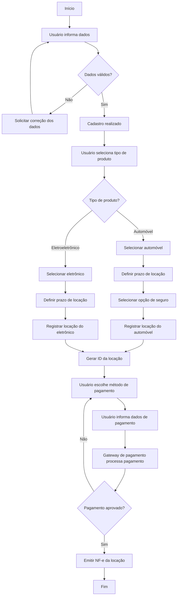

## Membros do Grupo: 
- Ana Carolina Lazzuri - 22.123.001-4
- Paulo Hudson - 22.222.013-9
- Nathan Gabriel da Fonseca Leite - 22.123.028-7
- Raphael Garavati Herbert - 22.123.014-7
---
# LocaFácil

## Objetivo do Projeto
O objetivo deste laboratório é a criação de uma plataforma que facilite o acesso à locação de automóveis e eletrônicos, permitindo que pessoas físicas e empresas utilizem bens de alto custo sem a necessidade de aquisição.

---

## Domínio do Sistema

- **Domínio:** Locação de automóveis e eletrônicos  
- **Problema resolvido:** Facilita o acesso a bens de alto custo por meio de locação  
- **Usuários principais:** Pessoas físicas e empresas  

---

## Visão Geral do Sistema

- **Nome do sistema:** LocaFácil  
- **Usuários principais:** Pessoas físicas e empresas  
- **Funcionalidades principais:**
  - Cadastro de usuários
  - Locação de automóveis e eletrônicos
  - Seleção de seguro para automóveis
  - Pagamento da locação

---

## Processos de Negócio

### Cadastro
- **Entrada:** Dados do usuário  
- **Saída:** Cadastro realizado  
- **Atores envolvidos:** Usuário  

### Locação
- **Entrada:**  
  - Seleção do produto (automóveis ou eletrônicos)  
  - Prazo de locação  
  - Opção de contratação de seguro (para automóveis)  
- **Saída:** Identificador da locação  
- **Atores envolvidos:** Usuário  

### Pagamento
- **Entrada:** Método de pagamento e dados de pagamento  
- **Saída:** Nota fiscal eletrônica (NF-e) da locação  
- **Atores envolvidos:** Usuário e gateway de pagamento  

---

## Diagrama Simplificado de Processo

---

## Linguagens e Framewors utilizados

- React
- NodeJS
- PostgreeSQL
